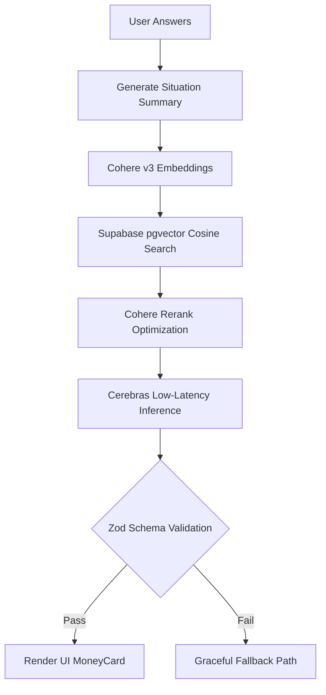

# Clarity — Your Eligibility AI

> A benefits guidance tool powered by AI, built for the people who need it most.

**Team:** FluxCore
**Track:** College / Undergraduate — AI for Life & Work
**Challenge Direction:** Public Services — Fix Systems People Depend On (Benefits Navigator)
**Hackathon:** USAII Global AI Hackathon 2026
**Live Demo:** *(https://clarity-ai-mu-topaz.vercel.app/)*
**Repository:** *(https://github.com/d3rd-dotcom/Clarity-AI)*

---

We're excited to share **Clarity**, our submission to the USAII Global AI Hackathon 2026, Public Services track.

We're building Clarity, an AI-native benefits guidance tool that helps people in the UK find money they're already owed but never claim.

When we started researching this space, we couldn't believe the number we found. **£24.1 billion** in UK benefits goes unclaimed every single year, according to Policy in Practice's 2025 national report.

Three things hit us hard. How invisible the problem was: most people have no idea this much money sits unclaimed each year. How fragmented the system is: dozens of benefits, each on its own GOV.UK page, written for caseworkers rather than the people who actually need them. And how the loss falls hardest on those who can least afford it: single parents, carers, people managing a health condition while also managing five different government forms.

And that gap has a human cost behind it. The report's own director put it bluntly:

> "It's not a failure of the public. It's a failure of a social security system that is still too complex, too fragmented and too passive."

Over **7 million households** are missing an average of **£3,428 a year** each. Universal Credit alone accounts for **£11.1 billion** of that gap.

So we built Clarity. A short set of plain-language questions, matched against real GOV.UK eligibility rules through a retrieval-augmented AI pipeline, returning a personalized answer in under two minutes — not a chatbot guessing, but a system that shows its reasoning and always routes the final decision back to GOV.UK.

In our test profile, a single parent renting privately with two children was shown she may be leaving **£969 a month** unclaimed, across three benefits she didn't know applied to her.

We're grateful to our mentors and the USAII Global AI Hackathon for pushing us to build this the right way — human problem first, AI second.

---

## The Person Behind This Project

Sarah is a 28-year-old single mother of two in Manchester.
She works part-time at a supermarket because childcare costs make full-time work financially impossible.
She rents a flat. She has heard of Universal Credit but assumed she earns too much to qualify.
She has never heard of Child Benefit as its own separate payment.
Nobody told her.

Every year, stories like Sarah's repeat across the UK — and **£24.1 billion** in benefits go unclaimed as a result.

Not because people are lazy.
Because the system was never built for them.

---

## The Problem (Verified Data)

The UK benefits system spans dozens of benefit types, each with its own eligibility page, written in
bureaucratic language, cross-referenced with other benefits, and updated on its own schedule.

According to Policy in Practice's 2025 "Missing Out" report:

- **£24.1 billion** in income-related benefits and social tariffs will go unclaimed in the UK in 2025/26
- Over **7 million households** are missing out
- The average affected household misses **£3,428 per year**
- **Universal Credit** alone accounts for £11.1 billion of that unclaimed total — the largest single category
- **Pension Credit** has a take-up rate of just **62%** among eligible pensioners (DWP official statistics)
- **Carer's Allowance**: £2.4 billion unclaimed, affecting an estimated 554,000 unpaid carers

In the words of Deven Ghelani, Director of Policy in Practice:

> "It's not a failure of the public. It's a failure of a social security system that is still too complex, too fragmented and too passive."

That sentence is the entire thesis of this project.

---

## What Clarity Does

Clarity is a benefits guidance tool. It asks a short series of plain-language questions, identifies which
benefits a person likely qualifies for, explains each one in plain English, and gives them a clear next
step — in under two minutes.

It does not replace GOV.UK.
It makes GOV.UK accessible.

### The Intake Questions

| # | Question | Why It Matters |
|---|----------|----------------|
| 1 | What is your current work situation? | Determines Universal Credit and income-based eligibility |
| 2 | Who do you live with? | Determines household benefit combinations |
| 3 | What is your housing situation? | Determines Housing Benefit / housing element eligibility |
| 4 | How old are you? | Affects Pension Credit and age-based thresholds |
| 5 | Do you have a health condition or disability? | Determines PIP and Carer's Allowance eligibility |
| 6 *(conditional)* | How many dependent children do you have? | Only shown if household includes children — drives Child Benefit, Child Tax Credit, Free School Meals |

The sixth question only appears when relevant (single parent / couple with children), keeping the flow as
short as possible for every user.

### What the User Sees

After completing the wizard, the user receives:

- A **MoneyCard** — the signature UI element — showing the estimated total monthly and weekly amount
  they may be leaving unclaimed
- A list of matched benefits, each with a confidence badge (Strong match / Possible match / Complex case)
- A plain-language explanation of why they likely qualify
- An expandable, step-by-step claim checklist per benefit, sourced and dated from GOV.UK
- A "Verify on GOV.UK" link on every single result
- A disclaimer confirming no data is stored

### Example Result

> **You may be leaving £969 per month unclaimed.**
>
> Universal Credit — £676/month — Strong match
> Child Benefit — £184/month — Strong match
> Free School Meals — £110/month — Strong match

That number is the entire product. Everything else — the RAG retrieval, the LLM reasoning, the UI — exists
to produce that number, correctly, for that specific person.

---

## Benefits Covered

Clarity's first version covers seven of the most commonly unclaimed UK benefits, chosen for maximum
real-world impact within a feasible scope.

| Benefit | Who It Helps |
|---|---|
| Universal Credit | Low income or unemployed, broadest eligibility |
| Child Benefit | Anyone responsible for a child under 16 (or under 20 in education) |
| Housing Benefit | Pension-age renters or those in supported/temporary accommodation |
| Child Tax Credit | Existing claimants not yet migrated to Universal Credit |
| Free School Meals | Children in households receiving qualifying benefits |
| Personal Independence Payment (PIP) | Long-term health conditions or disability |
| Carer's Allowance | 35+ hours/week caring for someone receiving a qualifying disability benefit |

All data is sourced directly from public GOV.UK eligibility pages under the Open Government Licence,
manually structured and dated April 2025.

---

## How the AI Works

Clarity is a benefits guidance tool first. The AI is what makes it work at scale — but it stays in the
background, and its reasoning is always shown, never hidden.

### Step 1 — Situation Summary
The user's answers are converted into a natural-language situation description.
Example: *"The person is a single parent who is unemployed and not working. They have 2 children. They
are renting a property privately. They are aged between 25 and 60. They have no health conditions or
disabilities."*

### Step 2 — RAG Retrieval



That situation is embedded using Cohere's `embed-english-v3.0` model and matched via cosine similarity
search against a knowledge base of GOV.UK eligibility data stored in Supabase using `pgvector`, with an
HNSW index for fast retrieval. Cohere Rerank (`rerank-english-v3.0`) re-orders results by true relevance
when more than the needed number of chunks are returned.

### Step 3 — AI Reasoning
The retrieved eligibility rules and the user's situation are passed to **Cerebras** (primary LLM, chosen
for low-latency inference) with **Groq** as an automatic fallback if Cerebras is unavailable. The model is
instructed to assess each benefit, assign a confidence level, and explain its reasoning in plain English —
and is explicitly forbidden from claiming final eligibility.

### Step 4 — Validated Output
Every LLM response is validated against a strict Zod schema before it ever reaches the user. Malformed or
incomplete responses never reach the frontend — they trigger the fallback path instead (see below).

### What the AI Does Not Decide
The AI does not determine final eligibility. That decision always belongs to GOV.UK and the relevant
government agency. This is enforced in the system prompt, the output schema, and the UI itself — the
"Verify with GOV.UK" link appears on every single result, not buried in a footer.

### Fallback Behaviour
If embedding, retrieval, or generation fails at any point, the backend automatically serves one of three
pre-verified demo profiles instead of an error — covering a single parent / unemployed / renting
situation, a couple with part-time employment, and a single person unable to work due to a health
condition. The user never sees a failure state, and judges reviewing a live demo will never hit a dead end.

---

## Technical Architecture (As Built)

| Layer | Technology | Purpose |
|---|---|---|
| Frontend | Vue 3 + TypeScript + Pinia + Vite | 6-step wizard, results display, state management |
| Styling | Tailwind CSS v4 | Warm, trustworthy, accessible design system |
| Backend | Express + TypeScript (Node 20+) | RAG pipeline API, validation, rate limiting |
| Embeddings | Cohere `embed-english-v3.0` | Converts text into searchable vectors |
| Reranking | Cohere `rerank-english-v3.0` | Improves retrieval accuracy (optional, automatic) |
| Vector Store | Supabase (pgvector + HNSW index) | Stores and retrieves GOV.UK eligibility chunks |
| Primary LLM | Cerebras (`gpt-oss-120b`) | Fast inference for eligibility reasoning |
| Fallback LLM | Groq (`llama-3.3-70b-versatile`) | Automatic failover if Cerebras is unavailable |
| Validation | Zod | Schema validation on every LLM response |
| Deployment | Vercel (frontend) | Live URL for judges and users |
| Data Source | GOV.UK public eligibility pages | Manually structured, openly licensed, dated |

### Repository Structure

```
.
├── backend/          Express + TypeScript RAG pipeline (API)
│   ├── api/          assess.ts, health.ts, index.ts (protected re-index endpoint)
│   ├── lib/           embed.ts, retrieve.ts, generate.ts, indexer.ts, clients.ts
│   ├── data/benefits/  7 benefit JSON files (eligibility rules, amounts, claim steps)
│   ├── data/fallbacks/ 3 pre-verified demo profiles
│   └── setup.sql       Supabase schema, RPC functions, RLS policies
└── frontend/         Vue 3 + TypeScript wizard UI
    ├── components/    form/, results/, ui/
    ├── stores/        formStore.ts (wizard logic), resultsStore.ts (API state)
    ├── composables/   useAssess.ts, useHealth.ts
    └── data/          claimChecklists.ts (sourced, dated claim guidance)
```

Both projects run as independent processes in development and deploy independently — backend to
Railway/Render, frontend to Vercel — or together by serving the built frontend as static files from the
backend.

---

## Responsible AI — Full Considerations

### Data Accuracy
All eligibility rules are sourced directly from GOV.UK public pages, manually transcribed and dated
(April 2025). `backend/data/VERIFY.md` documents the annual review process for keeping rates current as
UK benefit amounts typically change each April.

### Harm Identification
- **Misclassification** — confidence meter (High / Medium / Needs Review) flags uncertain results,
  particularly for health and disability benefits requiring formal assessment
- **Over-reliance** — consistent "may qualify" language throughout; never "you qualify"
- **Outdated amounts** — every figure is timestamped; a documented review process exists for the annual
  April uprating
- **Privacy exposure** — no accounts, no data storage; answers exist only in-session and are discarded on
  refresh; health and disability data is never logged server-side (special-category data under UK GDPR)

### Bias Awareness
The knowledge base is built from standard GOV.UK eligibility pages and performs best on common cases.
Non-standard employment, complex household arrangements, or immigration-status edge cases are
automatically flagged Needs Review rather than confidently guessed at.

### Explainability
Every result shows the specific GOV.UK rule that triggered the match, a confidence rating, and a
plain-language explanation. The AI never produces a result without showing its reasoning.

### Security
- Strict CORS allowlisting in production (no wildcard fallback)
- Rate limiting on all endpoints (tighter limits on the AI-assessment and re-indexing endpoints)
- The protected re-indexing endpoint requires a constant-time secret comparison
- Helmet-applied HTTP security headers on every response
- `npm audit --audit-level=high` runs in CI on every push

---

## Impact

### For One Person
A user discovers a specific, personalized monthly figure they've never seen before, understands exactly
why they qualify, and has a concrete next step — in two minutes, without reading a single government page.

### At Scale
If tools like Clarity helped recover even 1% of the £24.1 billion currently unclaimed, that is over
**£240 million** redirected to the households Parliament intended to support.

### For the System
By surfacing eligibility in plain language and routing every result back to GOV.UK for confirmation,
Clarity reduces the burden on services like Citizens Advice while increasing the effectiveness of
support that already exists.

---

## Future Roadmap

**Near-term:** expand from 7 to the full range of UK benefits; live GOV.UK API integration for real-time
amounts; a document-upload feature that explains benefits forms field by field.

**Longer-term:** coverage for Scotland, Wales, and Northern Ireland's devolved benefit variations;
partnerships with Citizens Advice and similar organisations for a direct human-handoff path on Needs
Review cases.

---

## Team — FluxCore

| Role | Responsibilities |
|---|---|
| Product & Pitch | Problem research, user story, USAII submission, pitch deck, demo script, responsible AI narrative |
| Technical Lead | RAG pipeline, LLM integration, frontend, deployment, testing |

---

## Data Sources

All eligibility data is sourced from GOV.UK public pages under the Open Government Licence:

- gov.uk/universal-credit/eligibility
- gov.uk/child-benefit/eligibility
- gov.uk/housing-benefit/eligibility
- gov.uk/child-tax-credit/eligibility
- gov.uk/apply-free-school-meals
- gov.uk/pip/eligibility
- gov.uk/carers-allowance/eligibility

Problem-scale statistics are sourced from Policy in Practice's "Missing Out 2025" report (September 2025)
and official DWP take-up statistics.

No private or user-identifying data is collected, stored, or logged at any point.

---

## One Last Thing

Clarity is not an AI automation tool.
It is a benefits guidance tool, powered by AI.

The difference matters.

AI should not replace the systems designed to support people.
It should make those systems visible — in plain language, in pounds per month, in two minutes — to the
people they were always meant to help.

---

*Clarity — Your Eligibility AI*
*Team FluxCore | USAII Global AI Hackathon 2026*
*College / Undergraduate Track — AI for Life & Work*
